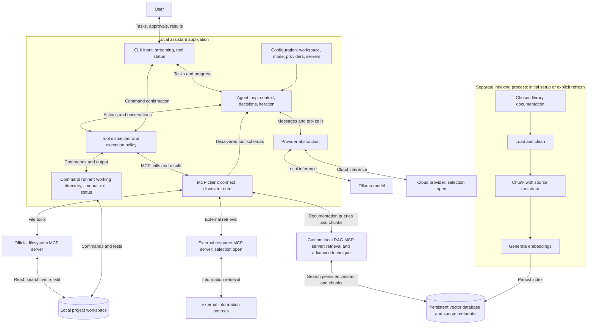

# CLI Coding Assistant

## October 8, 2026 — Edric check-in implementation

**Current status:** The official filesystem MCP server and external Context7 MCP
server have been invoked successfully in one repeatable terminal demonstration.
The model/tool loop and Groq adapter completed a live autonomous task with both
servers and four passing behavior tests. AWS Bedrock and Ollama are explicit skeletons. Custom
advanced RAG and the final evaluation/report/video remain outstanding.

The October 1 plan below is retained as the original design baseline. Its dated
status and tentative choices describe that earlier submission.

### Setup

Prerequisites: Python 3.12 and Node.js 18 or newer. From the repository root:

```console
python3.12 -m venv .venv
source .venv/bin/activate
python -m pip install -r requirements.txt
npm ci
edric doctor --offline
```

On this Mac the environment and dependencies are already installed. Start with:

```console
source .venv/bin/activate
edric tools
edric demo checkin --reset
python -m unittest discover -s .edric/checkin-workspace -p test_client.py -v
```

The demo makes predetermined calls to actual MCP servers: filesystem listing and
reading, live HTTPX documentation retrieval, a documentation write, a code edit,
and exact readback. Its four offline behavior tests run in the separate command
above. It uses no model API. Context7 worked without a key during the October 8
rehearsal; an account key may be needed for access or higher limits later.

### Autonomous assistant

Create a Groq key on its Free Plan and enter it through hidden local input:

```console
edric setup --groq-only
edric demo agent --reset --mode confirm
```

The assistant discovers MCP tools, passes selected schemas to Groq, displays each
requested action, executes permitted calls, returns observations to the model,
and repeats until a final response or limit. Confirmation mode asks before file
changes and commands; auto mode executes enabled tools without those prompts.
The demo resets only marked generated files and rejects arbitrary nonempty folders.

General usage:

```console
edric chat --workspace /absolute/path/to/project --mode confirm
edric run "Inspect the code and explain the failing test" --workspace /absolute/path/to/project
edric run "Fix the empty-input bug and run the tests" --workspace /absolute/path/to/project --mode auto
```

Each task starts a fresh conversation. Tool execution is sequential and bounded.
A final model answer is not independent proof of task success; inspect actual
tool results and test output. There is no automatic paid-provider fallback. Keys
stay in ignored local `.env`; never commit them. Workspace selection controls
filesystem-server access and command cwd; commands are not sandboxed.

### Configuration and verification

Defaults connect the local pinned filesystem server and remote Context7. To
customize, copy `mcp_servers.example.json` to ignored `mcp_servers.json`. Available
placeholders are `${PROJECT_ROOT}`, `${WORKSPACE}`, `${PYTHON}`, and environment
variables. Headers with missing credential values are omitted. The example also
contains a disabled Fetch fallback; enable it explicitly if Context7 is unavailable.
Use `--server filesystem` to connect only the filesystem server.

```console
python -m pytest -q
edric doctor
edric tools --verbose
```

Verified on October 8: **61 application tests passed**, both MCP servers performed
real calls, exact edited-file readback passed, and **4 generated example behavior
tests passed**. Separately, Groq's `openai/gpt-oss-120b` completed the autonomous
demo in **8 model turns and 7 tool calls**, retrieving documentation, editing the
code, and executing the four passing tests. Free Plan rate-limit waits can make
the autonomous demo take several minutes; the direct MCP demo avoids model limits.

- [Check-in commands and presentation guide](docs/checkin.md)
- [Provider keys and future AWS setup](docs/provider-setup.md)
- [Current architecture and workflows](docs/architecture.md)
- [Team ownership and handoff](docs/team-handoff.md)
- [Shared implementation contracts](docs/implementation-contracts.md)
- [Verified rehearsal record](docs/verification.md)

---

## October 1, 2026 — Initial planning submission

**Status:** Planning; implementation has not begun. The assistant name and several technical selections remain open.

This README contains both deliverables for the October 1 submission: an **initial architecture diagram** and a **project plan with division of labor and weekly milestones**. The design is provisional and will evolve as the team develops the system. This planning baseline will be committed before implementation and preserved in Git history.

## Project concept

Build an autonomous command-line coding assistant for developers working in a local codebase. It will turn natural-language requests into inspected and verified code changes, supporting code investigation, feature implementation, defect correction, and command/test execution. It will use local and external documentation when appropriate and distinguish completed work from work it could not finish or verify.

### Central workflow

1. The user launches the assistant in a local project, selects a model/provider and execution mode, and enters a coding task.
2. The assistant inspects relevant files and retrieves documentation when needed.
3. The model selects tools; the application displays the requested actions and applies the selected execution policy.
4. The application executes approved/permitted actions and returns their results to the model.
5. The assistant observes those results, makes further changes, and checks its work until the task is complete or a stopping condition is reached.
6. The assistant summarizes changes, validation results, and unresolved issues. The CLI displays streamed responses and tool activity throughout the process.

For example, a request to fix incorrect handling of empty input should lead to inspecting the function, reproducing the issue, editing the code, and running relevant tests. The outcome should be a corrected function supported by checks, or a clear explanation of what remains unresolved.

## First complete version — scope

| Area | Included capability |
| --- | --- |
| Interactive CLI | Accept natural-language tasks, stream responses, and display tool calls, execution status, and results. |
| Autonomous agent loop | Inspect, select tools, act, observe results, and iterate without requiring the user to direct every step. |
| Local code operations | Read, search, create, and edit project files through the official filesystem MCP server. |
| Command execution | Run commands and tests in the selected workspace and return output and exit status to the agent. |
| Execution modes | Support confirmation before command execution and an explicitly selected auto-execution mode. |
| Provider abstraction | Support Ollama and at least one cloud LLM provider through a shared interface. |
| MCP integration | Dynamically discover and invoke tools from the official filesystem server, one external resource server, and a custom RAG server. |
| Documentation retrieval | Retrieve external information through the external server and chosen library documentation through the custom RAG server. |
| Persistent advanced RAG | Load, chunk, embed, and store documentation; reuse the index across sessions; implement one advanced technique from the assignment's specified resource. |
| Completion and failure reporting | Summarize changes and checks, identify unresolved problems, and report cancellation, failures, or iteration limits clearly. |
| Assistant identity | Use a team-selected name and consistent CLI presentation. |

Failure limits and structured result reporting are planned reliability choices supporting the required agent loop. They are not separate additional course deliverables.

## Initial architecture diagram

The Mermaid diagram below renders on GitHub. Double-headed arrows represent requests and responses. All components describe planned behavior, not completed integrations.



### Component responsibilities and design boundaries

| Component | Responsibility |
| --- | --- |
| CLI | Collect tasks and approvals; render streamed text, progress, tools, and outcomes. Keep presentation separate from execution. |
| Agent loop | Maintain task context, pass discovered schemas to the model, append tool results, and repeat until completion or a stopping condition. |
| Provider abstraction | Normalize provider-specific streaming, messages, structured tool calls, and errors. |
| Tool dispatcher and policy | Validate tool arguments, route calls, apply confirmation/auto-execution, and return success, failure, or denial as observations. |
| MCP client | Connect to configured servers, dynamically discover tools, distinguish names from different servers, and handle calls and connection errors. |
| Filesystem server | Use the required `@modelcontextprotocol/server-filesystem` for file operations within the configured workspace. |
| External resource server | Supply external information relevant to coding tasks. The specific server remains open. |
| Command runner | Execute shell commands separately from the filesystem server, capturing output, exit status, and timeouts. |
| Custom RAG server | Embed queries, retrieve relevant indexed documentation, apply the selected advanced technique, and return chunks with source references. |
| Indexing and storage | Process a chosen library's documentation and persist its vectors, text, and metadata. Reuse the index during later sessions; refresh explicitly when needed. |

Use bounded execution and iteration limits to avoid endless runs. Keep credentials outside the repository. A command's working directory is not a security sandbox; use a disposable project for demonstrations. Keep provider, tool, retrieval, and interface boundaries clear so later changes do not require rewriting the entire application.

## Open decisions

Required capabilities remain committed even while their implementation choices are unresolved. **Open** means no selection has been made; **Proposed** means a candidate is under consideration; **Agreed** means the team has selected and recorded an approach. No candidate below is presented as an agreed or verified integration.

| Area | Status | Decision or next check |
| --- | --- | --- |
| Cloud provider/model | Proposed candidates | AWS Bedrock and SageMaker have been considered. Select a provider/model after checking access, cost, streaming, and tool-calling compatibility. |
| Ollama model | Open | Select and verify a model suitable for available hardware and tool calling. Supporting Ollama does not promise compatibility with every open-weight model. |
| External MCP server | Open | Select a server that supports the information needs of the coding tasks and verify connectivity. |
| Documentation corpus | Open | Choose a library's documentation and define its version and initial scope. This is a documentation corpus, not a company knowledge base. |
| Advanced RAG technique | Open | Select a technique from the assignment's NirDiamant RAG Techniques resource based on usefulness, effort, and evaluability. |
| Vector storage and embeddings | Open; AWS storage proposed for investigation | Select the database and embedding model. Amazon S3 Vectors has been mentioned as a possibility; suitability and access have not been verified. |
| Implementation language/frameworks | Open | Confirm the stack and compatible dependencies before implementation. |
| Assistant identity | Open | Select the unique name and CLI presentation. |
| Individual assignments | Proposed workstream split | Map teammates to the roles below and assign reviewers at kickoff. |

## Project plan and division of labor

The proposed split follows four implementation workstreams. Names remain unassigned. The project lead will own architecture, design, scope, coordination, and integration acceptance, with a substantive implementation responsibility proposed in Person 1's workstream. The lead role is not an additional fifth teammate.

| Owner / workstream | Responsibilities | Handoff and evidence |
| --- | --- | --- |
| Person 1 — Agent, CLI, and tool execution; proposed project lead | Architecture and interface contracts, CLI design, agent loop, tool dispatcher, command runner, confirmation/auto-execution, progress display, integration coordination. | Agree contracts by Oct 2; integrated model/tool loop by Oct 5; usable modes and status for Oct 7 rehearsal. Coordinate scope and blockers daily. |
| Person 2 — MCP client and filesystem | Server configuration/lifecycle, dynamic discovery, namespaced routing, official filesystem integration, connection errors. | Discovery and file-tool contract by Oct 3; working file operations through the agent by Oct 5. Support Person 4's external-server connection. |
| Person 3 — Custom RAG and advanced retrieval | Library corpus, chunking, embeddings, persistent vector storage, custom MCP server, advanced technique, retrieval evaluation. | Begin corpus and indexing work Oct 2; target baseline retrieval by Oct 7; complete advanced RAG integration by Oct 10 and evaluation by Oct 12. |
| Person 4 — External MCP, providers, and model evaluation | External resource integration, shared provider interface with Person 1, Ollama/cloud adapters, model comparison. | First provider path by Oct 3; external MCP through agent by Oct 6; both provider paths by Oct 10; comparison results by Oct 12. |
| Shared delivery responsibilities | Each owner tests and documents their component and reviews another owner's work. Person 1 coordinates the report and architecture; Person 2 checks clean setup and dependencies; Person 3 writes RAG analysis; Person 4 assembles model results and coordinates video recording. | All members review the report, demo, and final requirement checklist. Rebalance work if Person 1 or Person 4 becomes a bottleneck. |

By October 2, agree on provider messages, tool-call/result structures, CLI progress events, MCP configuration, and RAG result fields. Each workstream must integrate against those contracts rather than wait for every other component to finish. Record owners and reviewers when assignments are confirmed.

### Week 1 — October 1–8: planning and two-server check-in

| Date | Main objective | Deliverable or completion evidence |
| --- | --- | --- |
| Oct 1 | Establish the planning baseline | Complete this README's concept, scope, initial architecture, workstreams, open decisions, and schedule; commit planning before implementation. |
| Oct 2 | Confirm ownership, access, and interfaces | Assign teammates/reviewers, verify provider/server access, choose initial technical settings, and begin RAG corpus preparation alongside application setup. |
| Oct 3–4 | Build the agent and MCP foundation | CLI accepts a task; one provider responds; MCP tools are dynamically discovered; a filesystem tool result returns to the model and informs another action. |
| Oct 5–6 | Integrate the first two servers | File inspection/editing and external retrieval work through the agent. Integrate command execution, visible status, and execution modes. Continue baseline RAG independently. |
| Oct 7 | Stabilize and rehearse | Rehearse a repeatable CLI task with filesystem and external MCP calls visible. Record current limitations, challenges, and concrete next steps. |
| Oct 8 | Present the check-in | Demonstrate two of the three required MCP servers and discuss challenges and next steps thoroughly. Show additional RAG progress if ready. |

The check-in target is the filesystem and external resource servers. Target readiness on October 7 rather than relying on first integration during the check-in. If time tightens, defer optional work and polish while preserving the two-server agent path.

### Week 2 — October 9–15: full integration and delivery

| Date | Main objective | Deliverable or completion evidence |
| --- | --- | --- |
| Oct 9–10 | Complete required integrations | Finish custom RAG and the chosen advanced technique; confirm index reuse after restart; integrate all three MCP servers and both provider paths. |
| Oct 11–12 | Validate and evaluate | Run non-trivial coding tasks, failure cases, both execution modes, the same-task LLM comparison, and a baseline-versus-advanced RAG evaluation. Record evidence and limitations. |
| Oct 13–14 | Freeze features and prepare submission | Fix blocking defects; finish state/sequence diagrams, setup instructions, `requirements.txt`, report, and video. Verify clean setup on another teammate's machine. |
| Oct 15 | Final review and submission buffer | Check repository access, artifacts, and links; correct critical issues and submit before the course deadline of 11:59 p.m. |

### Evaluation and completion criteria

The first complete version must operate as one application, not just disconnected component demos.

- Demonstrate at least two non-trivial coding tasks with inspectable changes and relevant validation; explicitly identify unverified or incomplete outcomes.
- Visibly invoke the filesystem, external resource, and custom RAG MCP servers across the demonstration.
- Verify confirmation and auto-execution modes and both the Ollama and cloud provider paths.
- Compare at least two LLMs on the same task from the same starting code, using comparable tools and limits. Record model identifiers, task/test outcomes, elapsed time, and failures.
- Evaluate the selected advanced RAG technique against a baseline on the same documentation questions and corpus. Discuss retrieval relevance, latency, and examples of improvement or regression. This baseline comparison is our proposed evaluation method.
- Verify that the documentation index persists across sessions without automatic full re-indexing.
- Deliver readable code, README setup instructions, `requirements.txt`, a PDF report, and the video. Setup commands will be added when implementation exists; none are claimed to work at this planning stage.
- Preserve the original architecture and include an updated diagram and rationale if it changes. Final documentation must include a state diagram and at least two sequence scenarios covering at least three distinct end-to-end operations, with relevant confirmations and MCP/LLM calls.

The final state and sequence diagrams are scheduled deliverables; the initial component diagram above fulfills today's architectural planning scope.

### Scope boundary and design evolution

Additional capabilities remain proposed extensions until their purpose, effort, dependencies, and impact on required work are assessed. No optional extension is committed in this plan. Clear component boundaries should allow the codebase to evolve after submission without imposing an unneeded framework now.

Preserve the October 1 planning commit as the original design record. Later README changes should explain material design changes; the final report will reproduce the original architecture and any revised version.

## Planning sources

This plan combines the supplied **Group Project 2: CLI Coding Assistant** assignment with the team's **CLI AI Assistant PLANNING.md** draft. The assignment defines the required capabilities and deliverables; named technology candidates, ownership proposals, reliability choices, and intermediate dates are provisional team planning decisions.
