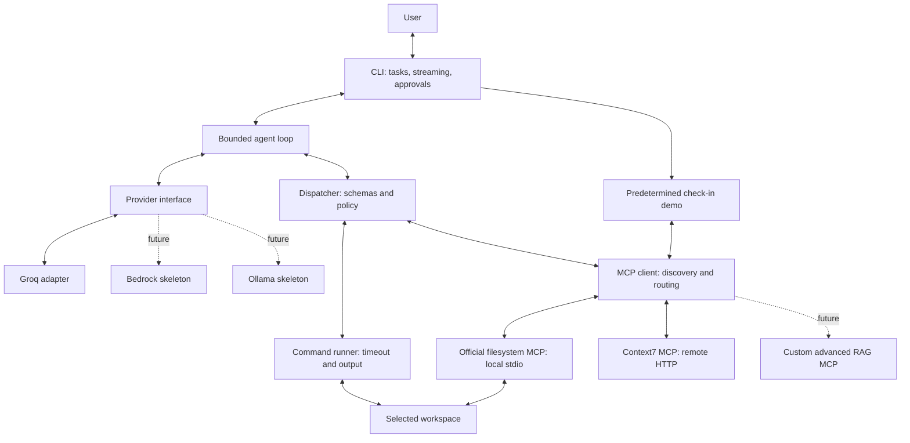
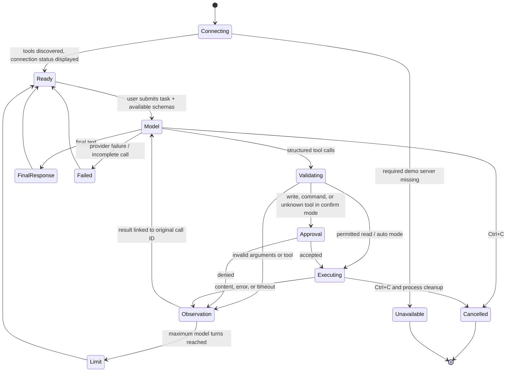
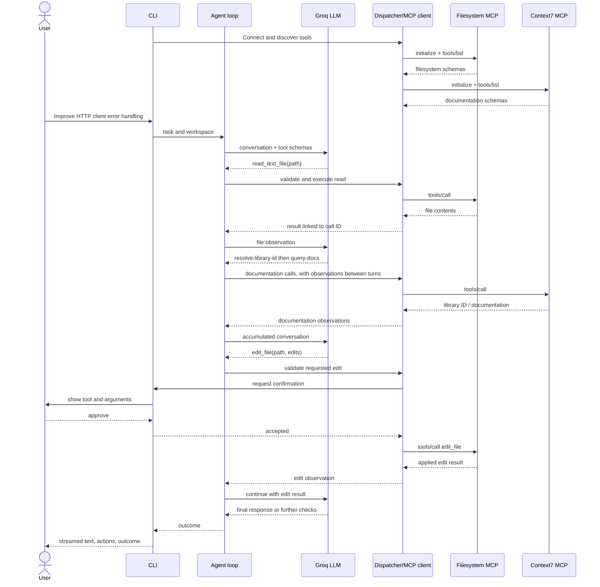
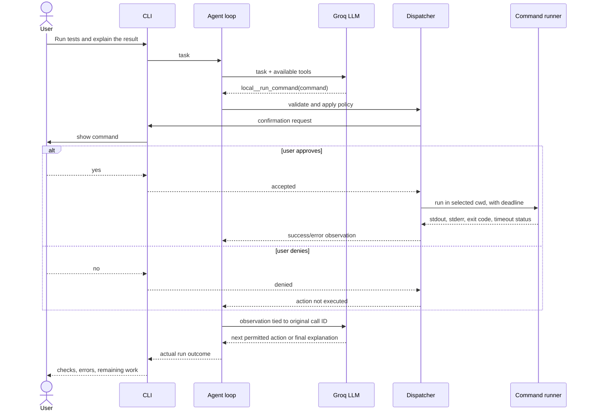

# Edric architecture — October 8 implementation

The original October 1 component diagram remains in README and planning Git
history. This version instantiates Python 3.12, Rich, the official MCP SDK 1.30,
the official filesystem server, Context7, and Groq. Bedrock/Ollama remain skeletons;
custom RAG has not been implemented. The direct demo and autonomous agent share
the MCP registry. The direct demo is a predetermined sequence, not model autonomy.

## Task state and information flow

`FinalResponse` describes model termination, not independently verified task
success. Failures and denials remain visible in the observations and final report.

## Scenario 1: inspect, consult docs, and edit

This scenario covers two operations: inspecting/updating local code and retrieving
external documentation. MCP schemas are loaded before the model task begins.

## Scenario 2: execute tests and observe a failure

This scenario adds command/test execution as the third distinct operation.

## Changes from planning

- Concrete stack choices replace the planning document's open candidates.
- Groq supplies the first cloud adapter; AWS is prepared for later implementation.
- SDK 1.x was chosen deliberately for compatibility with the Fetch fallback.
- Each MCP connection owns its async SDK contexts in a dedicated task, isolating
  failed servers and ensuring context managers close in the correct task.
- The direct demo provides independent MCP integration evidence while provider
  credentials or model behavior are being validated.
- RAG, Ollama, evaluation, and submission artifacts remain final-project work.
